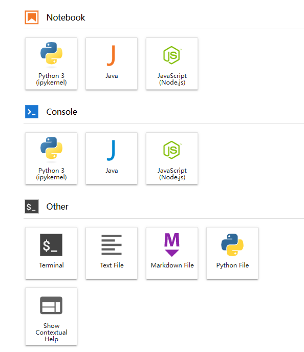
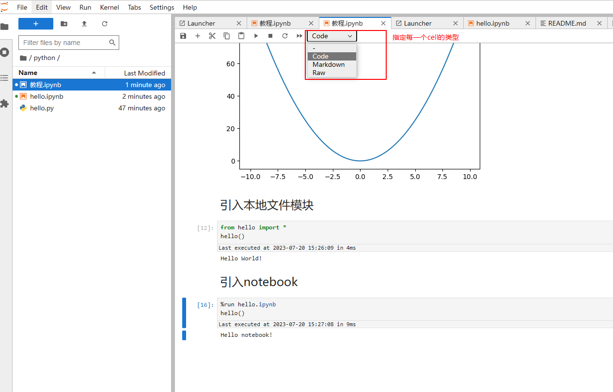
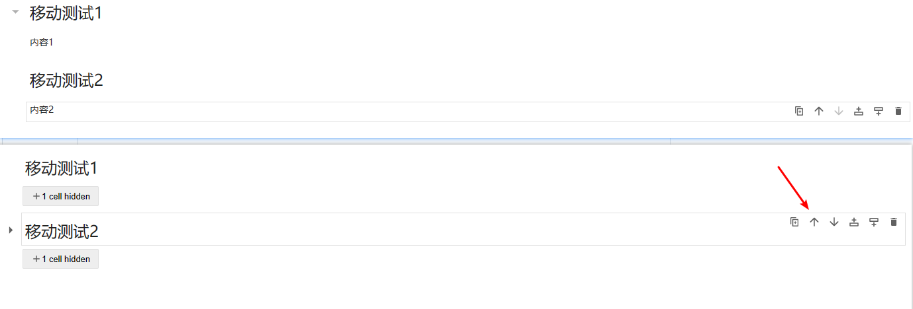
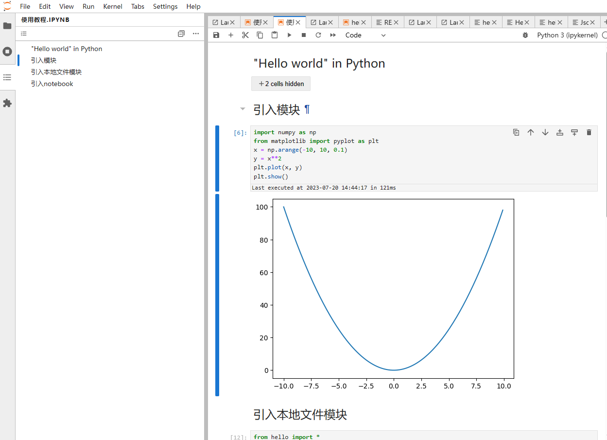

# [Jupyter](https://docs.jupyter.org/en/latest/)

Welcome to the Project Jupyter documentation site. Jupyter is a large umbrella project that covers many different software offerings and tools, including the popular Jupyter Notebook and JupyterLab web-based notebook authoring and editing applications. The Jupyter project and its subprojects all center around providing tools (and standards) for interactive computing with computational notebooks.

## Jupyter教程
[http://www.codebaoku.com/jupyter/jupyter-index.html](http://www.codebaoku.com/jupyter/jupyter-index.html)

Jupyter是一个可视化和交互式的Web集成开发环境。

## 部署

### Docker方式部署

```bash
docker run -d -it --name jupyter -p 8888:8888 -v /usr/local/data/jupyter:/home/jovyan jupyter/minimal-notebook
```

### Anaconda方式部署
下载[Anaconda](https://www.anaconda.com/download-success)，内置了Jupyter

### pip方式部署

```bash
pip3 install jupyter
# 启动
jupyter notebook
```

### 设置登录密码

**注意：进入容器默认用户名是jovyan，无sudo权限，可以切换到root用户**

```bash
# 以root进入容器
docker exec -it -u root container_id bash
# 例如
docker exec -it -u root jupyter bash
```

查看token，设置登录密码
```bash
# 容器内执行
jupyter server list
```

### 添加其他语言内核
[https://github.com/jupyter/jupyter/wiki/Jupyter-kernels](https://github.com/jupyter/jupyter/wiki/Jupyter-kernels)

查看已添加的语言内核
```bash
jupyter kernelspec list
```

添加JavaSript和Java示例
```bash
# Javascript
npm install -g ijavascript
ijsinstall


# Java
apt-get update
apt install openjdk-17-jdk
mkdir ijava
cd ijava
wget https://github.com/SpencerPark/IJava/releases/download/v1.3.0/ijava-1.3.0.zip
unzip ijava-1.3.0.zip
# Pass the -h option to see the help page
python3 install.py -h
# Otherwise a common install command is
python3 install.py --sys-prefix
```

## 入门教程
### 1.新建
可以新建任意扩展名的文件、Terminal、Notebook。


### 2.Notebook
Notebook是一个交互式的执行器，可以添加多个执行语句，也称为cell。


### 3.快捷键
执行cell: Ctrl + Enter

执行并自动跳到下一个cell: Shift + Enter

### 4.注意事项
当移动cell的时候，并不会按照markdown目录移动，可以按Z键撤销。


### 5.使用教程
使用jupyter打开此仓库，使用教程见`java`, `js`, `python`等文件夹下的`使用教程.ipynb`



